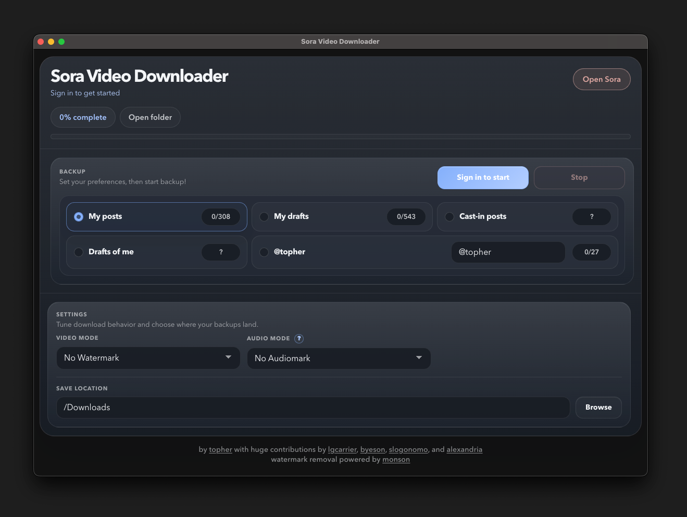

# Sora Video Downloader

Desktop app for saving your Sora videos and draft prompts! [**Get the app here!**](https://github.com/cameoed/sora-video-downloader/releases/tag/v1.0.0)



## Features

- Sign in through the built-in `Open Sora` flow, with manual bearer-key fallback if needed
- Save from:
  `My Posts`, `My Drafts`, `My Draft Prompts`, `Cast-in Posts`, `Drafts of Me`, `My Post Stats`, `Character Posts`, `Character Drafts`, and `Character Stats`
- No-watermark mode with provider failover
- AI label controls:
  `No AI Label` or `With AI Label`
- Crop controls:
  `Default Crop` or `Cropped for Social Media`
- Progress UI with page-aware scan updates
- `Open folder` shortcut after a run
- `Clear cache` for remembered download history
- Prompt CSV export with similar draft prompts de-duplicated

Built by [topher](https://github.com/cameoed) with huge contributions by [lgcarrier](https://github.com/lgcarrier), [byeson](https://github.com/byeson), [slogonomo](https://github.com/slogonomo), [alexandria](https://github.com/alexdredmon), [udio](https://github.com/nikaskeba/).

Watermark removal powered by [monson](https://kontenai.net?ref=topher) and [soravdl](https://soravdl.com).

## Install

Use the latest GitHub Release if you just want the app.

macOS:
1. Download the correct `.dmg`
2. Drag `Sora Video Downloader.app` into `Applications`
3. If macOS blocks it, run:

```bash
sudo xattr -rd com.apple.quarantine "/Applications/Sora Video Downloader.app"
```

Windows:
1. Download the latest `.exe`
2. Run the installer

## Use

1. Open the app
2. Click `Open Sora`
3. Sign in
4. Pick a backup type
5. Pick your settings and download folder
6. Click `Start backup`, `Save prompts`, `Save post stats`, or `Save character stats`

## Backup Types

- `My Posts`
  Downloads your published Sora posts.

- `My Drafts`
  Downloads your draft videos.

- `My Draft Prompts`
  Saves a CSV of draft prompts.
  Similar prompts are de-duplicated before export.

- `Cast-in Posts`
  Downloads posts where you appear.

- `Drafts of Me`
  Downloads drafts where you appear.

- `My Post Stats`
  Saves a CSV of your post stats.

- `Character Posts`
  Downloads posts for the handle entered in the character box.

- `Character Drafts`
  Downloads drafts for the handle entered in the character box.

- `Character Stats`
  Saves a CSV of stats for the handle entered in the character box.

## Settings

- `Video Mode`
  `No Watermark` tries to save a no-watermark version.
  `With Watermark` keeps the original version.
  For draft downloads, `No Watermark` first creates an unlisted shared link and then sends that public link through the existing no-watermark providers.
  If Sora requires more auth for draft no-watermark downloads, the app will prompt for the matching Cookie and Bearer headers from your browser session.
  The app tracks these draft copy-link actions locally because Sora only allows `500` of them per day.

- `AI Label`
  `No AI Label` removes the audiomark and strips C2PA manifest data.
  `With AI Label` keeps the original labeling.

- `Crop`
  `Default Crop` keeps the source framing.
  `Cropped for Social Media` exports social-ready framing.

- `Download folder`
  Chooses the download folder where exports and prompt CSVs are written.

## Output

By default, everything is saved in `~/Downloads/Sora Video Downloader`.

Inside that download folder, export folders keep the existing settings in the same folder name, with the logged-in account added in front, for example:

- `@username's Sora Posts - No Watermark, With Label, Default Crop`
- `@username's Sora Drafts - No Watermark, With Label, Default Crop`
- `@username's Cast-In Posts - No Watermark, With Label, Default Crop`
- `@username's Sora Prompts`

Character post downloads use the character handle as the folder name, for example `@character - No Watermark, With Label, Default Crop`.

`My Draft Prompts` writes a CSV file named like `@username's Draft Prompts.csv` inside `@username's Sora Prompts`.
The CSV starts with:

`All draft prompts with similar prompts de-duplicated!`

## Cache

`Clear cache` resets remembered download history for selected modes or characters.
Remembered download history is tracked separately for each Watermark / AI Label / Crop combination.
It does not delete files already saved on disk.
Interrupted scans are checkpointed locally, so restarting a failed backup resumes from the last saved page cursor and reuses completed scan results for unfinished downloads when possible.

## Run From Source

```bash
npm install
npm run start:app
```

## Build

```bash
npm run dist:mac
npm run dist:win
```

## Notes

- Unofficial community tool
- Not affiliated with Sora or OpenAI
- Data stays on your machine
- Built with Electron for macOS and Windows

## License

MIT. See [LICENSE](./LICENSE).
